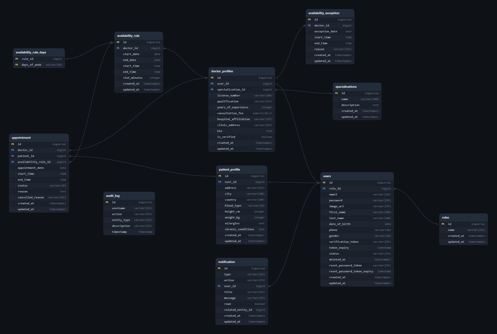

# Medic - Medical Appointment Booking Platform

## Project Information

Medic is a comprehensive backend application designed to manage medical appointments between doctors and patients. It
serves as a secure, role-based platform where patients can find doctors, view their availability, and book appointments,
while doctors can manage their schedules, availability rules, and appointment history.

### Main Features

- **Role-Based Access Control:** Distinct roles for Patients, Doctors, and Administrators.
- **Secure Authentication:** JWT-based authentication with email verification and password recovery.
- **Profile Management:** Users can manage their profiles and upload avatars.
- **Advanced Booking System:** Real-time availability calculation based on doctor-defined schedules and exceptions.
  Double-booking prevention.
- **Real-Time & Email Notifications:** Server-Sent Events (SSE) push notifications for appointment updates, with
  matching
  styled email notifications.
- **Security & Reliability:** Global exception handling, API rate limiting using Redis, and comprehensive audit logging.
- **API Documentation:** Interactive Swagger/OpenAPI documentation.

## Demo Credentials

The application is pre-seeded with sample data to allow you to easily test the endpoints without needing to register new
accounts.

| Role    | Email                | Password  |
|---------|----------------------|-----------|
| Admin   | `admin@medic.com`    | `Potato!` |
| Doctor  | `doctor1@medic.com`  | `Potato!` |
| Patient | `patient1@medic.com` | `Potato!` |

## Technologies

- **Java 17**
- **Spring Boot 4.1.1**
- **Spring Web MVC** for REST APIs
- **Spring Security** for authentication and role-based authorization
- **JJWT** for JWT creation and validation
- **Spring Data JPA** for persistence
- **PostgreSQL** as the main relational database
- **Spring Validation** for request validation
- **Spring Mail** for email delivery
- **Thymeleaf** for styled HTML email templates
- **Spring Data Redis** for Redis integration
- **Bucket4j** with Redis support for rate limiting
- **Spring AOP** for cross-cutting concerns such as audit logging
- **Spring Boot Actuator** for health/monitoring endpoints
- **Springdoc OpenAPI / Swagger UI** for API documentation
- **MapStruct** for DTO/entity mapping
- **Lombok** for reducing boilerplate
- **Server-Sent Events (SSE)** for real-time notifications
- **JUnit** and **Spring Boot Test** for testing
- **Spring Boot DevTools** for local development
- **Maven** for dependency management and builds

## Architecture

The application follows a clean-layered architecture:

- **Controllers:** Handle incoming HTTP requests and define API endpoints.
- **Services:** Contain the core business logic (e.g., availability calculation, booking validation).
- **Repositories:** Manage data persistence using Spring Data JPA.
- **Database:** PostgreSQL for persistent data storage.

Additional architectural components include distinct layers for DTOs, MapStruct Mappers, Security Configurations, Global
Exception Handling, and custom Annotations (e.g., for Audit Logging).

## Booking Engine Design

The appointment booking system utilizes a highly efficient **rule-based engine** rather than a naive date-generation
model.

### Why Rule-Based?

A naive approach (generating and storing rows for every possible 15-30 minute slot for the next 5 years or even 3
months) would result in a massive database footprint (millions of rows per doctor) and slow query performance.

Instead, the **Rule-Based Engine** models availability conceptually:

- **`AvailabilityRule`:** Defines a recurring schedule (e.g., "Monday and Wednesday, 9 AM to 5 PM, 30-minute slots, for
  the next 6 months").
- **`AvailabilityException`:** Defines temporary exceptions to the regular availability schedule, such as being sick for
  a day or taking vacation.
- **`Appointment`:** Represents actual booked slots.

When a patient queries a doctor's availability for a given date range, the engine **dynamically calculates** available
slots in real-time by:

1. Fetching all active `AvailabilityRule` for the doctor.
2. Generating a virtual schedule of time slots in memory.
3. Fetching and applying `AvailabilityException`s to cross out unavailable times.
4. Fetching existing `Appointment`s to cross out already booked slots.
5. Returning the final list of open slots to the user.

This approach guarantees high performance, negligible storage requirements, and immediate reflection of any schedule
changes.

## General Approach

The project was developed incrementally, starting with the core entity modeling and database design. Following this, the
authentication system (JWT) and role management were implemented. With secure access in place, the core business
entities (Profiles, Availability Rules) were built out. The most complex feature—the booking engine—was implemented
next, incorporating rules, exceptions, and double-booking guards. Finally, auxiliary features such as real-time SSE
notifications, file uploads, rate limiting, and audit logging were integrated.

## User Stories

User stories and project tracking were managed on Trello:
[View User Stories on Trello](https://trello.com/b/9VwIYDT1/medic)

## Entity Relationship Diagram (ERD)

The database schema was designed to cleanly separate user authentication data from profile-specific data and booking
logic.



## API Documentation

Interactive Swagger documentation is available at `http://localhost:8080/swagger-ui.html` when the application is
running.

### API Endpoints

| Request Type | URL                                               | Functionality                      | Access        |
|--------------|---------------------------------------------------|------------------------------------|---------------|
| POST         | `/auth/users/login`                               | User login                         | Public        |
| POST         | `/auth/users/register/patient`                    | Patient registration               | Public        |
| POST         | `/auth/users/register/doctor`                     | Doctor registration                | Public        |
| POST         | `/auth/users/register/admin`                      | Admin registration                 | Admin         |
| GET          | `/auth/users/verify`                              | Verify email address               | Public        |
| POST         | `/auth/users/forgot-password`                     | Request password reset             | Public        |
| POST         | `/auth/users/reset-password`                      | Reset password                     | Public        |
| POST         | `/auth/users/change-password`                     | Change password                    | Authenticated |
| POST         | `/auth/users/logout`                              | User logout                        | Authenticated |
| GET          | `/user`                                           | Retrieve user account              | Authenticated |
| PATCH        | `/user/avatar`                                    | Upload profile picture             | Authenticated |
| PATCH        | `/profile/patient`                                | Update patient profile             | Patient       |
| PATCH        | `/profile/doctor`                                 | Update doctor profile              | Doctor        |
| GET          | `/patient/appointments`                           | Get patient appointments           | Patient       |
| POST         | `/patient/appointments`                           | Book an appointment                | Patient       |
| PUT          | `/patient/appointments/{id}/cancel`               | Cancel an appointment              | Patient       |
| GET          | `/patient/appointments/doctors/{id}/availability` | View doctor availability           | Patient       |
| GET          | `/doctors/appointments`                           | Get doctor appointment history     | Doctor        |
| PATCH        | `/doctors/appointments/{appointmentId}/status`    | Update appointment outcome         | Doctor        |
| GET          | `/doctors/availability/calendar`                  | Get doctor calendar                | Doctor        |
| GET          | `/doctors/availability/rules`                     | List availability rules            | Doctor        |
| POST         | `/doctors/availability/rules`                     | Create availability rule           | Doctor        |
| PUT          | `/doctors/availability/rules/{id}`                | Update availability rule           | Doctor        |
| DELETE       | `/doctors/availability/rules/{id}`                | Delete availability rule           | Doctor        |
| GET          | `/doctors/availability/exceptions`                | List availability exceptions       | Doctor        |
| POST         | `/doctors/availability/exceptions`                | Create availability exception      | Doctor        |
| PUT          | `/doctors/availability/exceptions/{id}`           | Update availability exception      | Doctor        |
| DELETE       | `/doctors/availability/exceptions/{id}`           | Delete availability exception      | Doctor        |
| GET          | `/notifications/subscribe`                        | Connect to real-time notifications | Authenticated |
| PATCH        | `/admin/doctors/{id}/verify`                      | Verify a doctor profile            | Admin         |
| DELETE       | `/admin/users/{userId}`                           | Soft delete a user                 | Admin         |
| GET          | `/audit-logs`                                     | Get all audit logs                 | Authenticated |

## Installation

Follow these steps to run the application locally:

1. **Clone the repository:**
   ```bash
   git clone <repository-url>
   cd medic
   ```

2. **Configure Services:**
    - Ensure **PostgreSQL** is running on your system (default port 5432).
    - Ensure **Redis** is running on your system (default port 6379).
    - Create a PostgreSQL database named `medic`.

3. **Environment Variables:**
   Create a `.env` file in the root directory based on `.env.example`:
   ```properties
   SPRING_PROFILE=dev
   JWT_SECRET=your_super_secret_key_needs_to_be_long_enough
   JWT_EXPIRATION=86400000
   DB_URL=jdbc:postgresql://localhost:5432/medic
   DB_USERNAME=postgres
   DB_PASSWORD=your_password
   MAIL_USERNAME=your_email@gmail.com
   MAIL_PASSWORD=your_app_password
   APP_BASE_URL=http://localhost:8080
   REDIS_HOST=localhost
   REDIS_PORT=6379
    ```

4. **Start the Application:**
   Run the application using Maven:
   ```bash
   ./mvnw spring-boot:run
   ```

5. **Seed the Database:**
   The application will automatically initialize the database structure and seed roles and specializations from
   `src/main/resources/data.sql`.

6. **Access the Application:**
    - API Base URL: `http://localhost:8080`
    - Swagger UI: `http://localhost:8080/swagger-ui.html`

## Major Challenges

- **Availability Engine:** Calculating precise 15/30-minute appointment slots based on dynamic weekly schedules while
  excluding specific date/time exceptions and already booked appointments proved mathematically and logically
  challenging.

## Future Improvements

- **Integration Testing:** Expand test coverage by using the dedicated `test` profile (with the configured in-memory H2
  database) for comprehensive integration testing, rather than relying solely on mocked unit tests.
- **Redis Caching for Availability:** Optimize performance by caching the results of `computeAvailableSlots` in Redis.
  This cache will be strategically invalidated and refreshed only when a doctor updates their availability rules or
  exceptions.
- **Frontend:** Implement a complete frontend application (React) to consume the API.

## Credits & Resources

- Email Verification
  Flow: [Alexander Obregon](https://medium.com/@AlexanderObregon/email-verification-flows-with-spring-boot-and-expiring-tokens-e9b2a238d917)
- MapStruct Integration: [Baeldung](https://www.baeldung.com/mapstruct)
- AOP Logging: [Baeldung](https://www.baeldung.com/spring-aspect-oriented-programming-logging)
- Global Exception
  Handling: [Roshan Farakate](https://medium.com/@roshanfarakate/global-exception-handling-in-spring-boot-712593159a26)
- Java Constants Best
  Practices: [Santiago Barbieri](https://medium.com/@barbieri.santiago/java-constants-best-practices-648fc562bb08)
- Spring REST OpenAPI Documentation: [Baeldung](https://www.baeldung.com/spring-rest-openapi-documentation)
- JWT Logout &
  Redis: [GitConnected](https://levelup.gitconnected.com/invalidate-blacklist-the-jwt-using-redis-logout-mechanism-in-spring-security-86b23149699a)
- Rate Limiting with
  Bucket4j: [Medium](https://medium.com/@prajpatil29/implementing-rate-limiting-with-redis-and-spring-boot-a-deep-dive-0bd000bcd98c)
- Server-Sent Events
  (SSE): [Medium](https://medium.com/@vishalpriyadarshi/real-time-event-streaming-in-spring-boot-using-server-sent-events-sse-a-guide-for-modern-f1048d3f5796)
- Spring Data JPA Specification: [Dev.to](https://dev.to/saladlam/spring-data-jpa-about-specification-interface-56ed)
